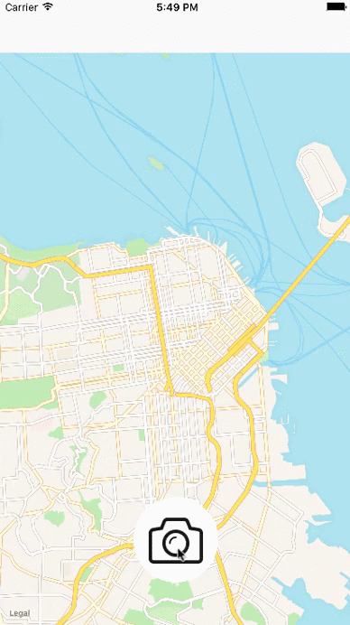

# Photo Map

Photo Map is a photo map allows the user to take a photo, tags it with a location, and then sees a map with all the previously tagged photos..

Time spent: 3 hours spent in total

## User Stories

The following **required** functionality is completed:

- [X] Milestone 1: Setup
- [X] Milestone 2: Create the Map View
- [X] Milestone 3: Take a Photo
- [X] Milestone 4: Tag a Location
- [X] Milestone 5: Drop a Pin on the map
- [X] Milestone 6: Add the photo you chose in the annotation view

The following **optional** features are implemented:

- [ ] Bonus 1: Implement a Custom MKAnnotation
- [ ] Bonus 2: See Fullscreen Picture
- [ ] Bonus 3: Replace the Pin with an Image

## Video Walkthrough 

Here's a walkthrough of implemented user stories:

Walkthrough recorded by QuickTime Player.

## License

    Copyright 2017 Chi Hon Law

    Licensed under the Apache License, Version 2.0 (the "License");
    you may not use this file except in compliance with the License.
    You may obtain a copy of the License at

        http://www.apache.org/licenses/LICENSE-2.0

    Unless required by applicable law or agreed to in writing, software
    distributed under the License is distributed on an "AS IS" BASIS,
    WITHOUT WARRANTIES OR CONDITIONS OF ANY KIND, either express or implied.